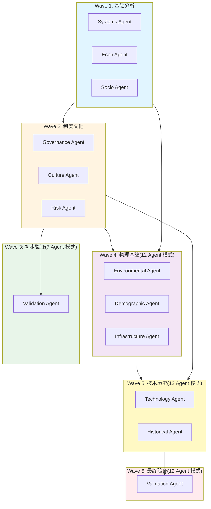

# Phase 4 执行计划:扩展 Agent 系统 (76-96 小时)

## TL;DR

> **快速摘要**:扩展 SocialGuessSkills 的推演能力,新增 5 个专业 Agent(环境/人口/基建/技术/历史),全面覆盖社会系统的物理基础、数字演进、路径依赖维度,形成 12 Agent 协同分析框架。
> 
> **交付成果**:
> - 5 个新 Agent Prompt 文件(environmental/demographic/infrastructure/technology/historical)
> - AgentType 枚举扩展(从 7 个到 12 个)
> - 执行波次重构(从 3 波扩展到 4-5 波)
> - 每个 Agent 的单元测试 + E2E 集成测试
> - 向后兼容现有 7 个 Agent
> - 详细文档(每个 Agent 的分析方法论)
> 
> **工作量估算**:76-96 小时
> **并行执行**:YES - 5 个 Agent 可并行开发(Phase 1-3),最后集成测试(Phase 4)
> **关键路径**:领域研究 → Prompt 设计 → 类型定义 → 工作流集成 → 测试验证

---

## Context

### 原始需求
在完成 Phase 1(生产就绪)、Phase 2(性能优化)、Phase 3(高级功能)后,用户希望**扩展 Agent 系统的分析维度**,从当前的 7 个基础 Agent(系统/经济/社会/治理/文化/风险/验证)增加到 12 个 Agent,覆盖:
1. **物理基础层**:环境、人口、基础设施
2. **技术演进层**:技术、数字化转型
3. **历史洞察层**:历史事件、路径依赖

### 需求讨论摘要
**关键讨论点**:
- **为何需要新 Agent**:现有 7 个 Agent 聚焦于社会结构与规则,但缺乏对**物理约束**(环境/基建)、**人口结构变化**(老龄化/迁移)、**技术冲击**(AI/自动化)、**历史路径依赖**(文化基因/制度惯性)的深度分析。
- **新 Agent 优先级**:
  - **高优先级**:Technology Agent(AI 与自动化对社会结构的冲击)
  - **中优先级**:Environmental/Demographic/Infrastructure/Historical Agent
- **集成策略**:新 Agent 必须向后兼容,不能破坏现有 7 个 Agent 的工作流。

**研究发现**:
- 现有 Agent Prompt 结构统一(角色/职责/框架/输出/约束/示例)
- 工作流采用 3 波执行:Wave 1(systems/econ/socio) → Wave 2(governance/culture/risk) → Wave 3(validation)
- 所有 Agent 输出 5 字段:**结论/依据/风险/建议/可证伪点**

### Metis Review(差距识别)
**已识别的差距**:
1. **类型定义缺失**:新 AgentType 枚举值(environmental/demographic/infrastructure/technology/historical)
2. **依赖关系不明**:新 Agent 应该在哪个 Wave 执行?
3. **领域专业性**:每个新 Agent 需要明确的分析框架(避免与现有 Agent 重叠)
4. **测试覆盖**:新 Agent 的单元测试 + E2E 集成测试

**如何解决**:
1. 扩展 `src/types.ts` 中的 `AgentType` 枚举
2. 更新 `src/workflow/dependency-analyzer.ts`(Phase 2 已规划)以支持 4-5 波执行
3. 为每个新 Agent 设计专业的**分析框架**(参考现有 7 个 Agent 的多维度方法)
4. 创建 `src/__tests__/agents/extended-agents.test.ts`

---

## Work Objectives

### 核心目标
从 7 Agent 系统扩展到 **12 Agent 协同分析框架**,全面覆盖社会系统的物理基础、技术演进、历史路径维度,提供更深度的系统推演能力。

### 具体交付成果
1. **5 个新 Agent Prompt 文件**:
   - `src/agents/prompts/environmental-agent.md`(环境)
   - `src/agents/prompts/demographic-agent.md`(人口)
   - `src/agents/prompts/infrastructure-agent.md`(基建)
   - `src/agents/prompts/technology-agent.md`(技术)
   - `src/agents/prompts/historical-agent.md`(历史)
   
2. **类型定义扩展**:
   - `src/types.ts`:AgentType 枚举新增 5 个值
   - `src/agents/agent-factory.ts`:支持 5 个新 Agent 的 Prompt 加载
   
3. **工作流集成**:
   - `src/workflow/orchestrator.ts`:支持 12 Agent 执行(可选启用新 Agent)
   - `src/workflow/dependency-analyzer.ts`:4-5 波执行策略(Wave 4:环境/人口/基建,Wave 5:技术/历史)
   
4. **测试覆盖**:
   - 单元测试:`src/__tests__/agents/extended-agents.test.ts`
   - E2E 测试:`src/__tests__/e2e-12agents.test.ts`
   - 向后兼容测试:确保 7 Agent 模式仍可用
   
5. **文档**:
   - `docs/extended-agents-methodology.md`:每个新 Agent 的分析方法论
   - `docs/12-agent-execution-flow.md`:执行波次拓扑图

### Definition of Done(完成标准)
- [ ] 5 个新 Agent Prompt 文件创建完成
- [ ] `bun test src/__tests__/agents/extended-agents.test.ts` → 全部通过
- [ ] `bun test src/__tests__/e2e-12agents.test.ts` → 12 Agent 完整推演通过
- [ ] 向后兼容:`bun test src/__tests__/e2e.test.ts` → 7 Agent 模式仍可用
- [ ] 测试覆盖率维持 ≥85%
- [ ] GLM API 模拟:12 Agent 输出包含所有新领域的 Mock 数据
- [ ] 文档完整:方法论 + 执行流程图

### Must Have(必须包含)
- **向后兼容**:现有 7 Agent 工作流不受影响
- **可选启用**:通过配置开关(如 `extendedAgents: true`)启用新 Agent
- **统一输出格式**:新 Agent 输出必须符合 5 字段标准(结论/依据/风险/建议/可证伪点)
- **领域专业性**:每个新 Agent 必须有明确的分析框架,避免与现有 Agent 职责重叠

### Must NOT Have(明确排除)
- ❌ **破坏现有 Agent**:不修改现有 7 个 Agent 的 Prompt 或逻辑
- ❌ **强制启用**:不强制所有推演使用 12 Agent(增加复杂度)
- ❌ **超范围集成**:不在 Phase 4 引入实时数据源(如气候 API、人口数据库)
- ❌ **过度细化**:不为每个新 Agent 创建子 Agent(如环境不拆分为气候/生态/资源)
- ❌ **UI 改动**:Phase 4 聚焦后端 Agent 系统,不修改 Web UI

---

## Verification Strategy(验证策略)

### Test Decision(测试决策)
- **Infrastructure exists**: YES(Bun test + 85% coverage)
- **Automated tests**: Tests-after(先实现 Prompt 和类型,再写测试)
- **Framework**: Bun test

### Agent-Executed QA Scenarios(Agent 执行的 QA 场景)

> 所有验证由执行 Agent 使用 Bun test 和 GLM API Mock 完成,无需人工干预。

#### Scenario 1: 新 Agent Prompt 文件加载
**工具**: Bash(Bun test)
**前提**: 5 个新 Prompt 文件已创建
**步骤**:
1. `bun test src/__tests__/agents/extended-agents.test.ts --test-name-pattern="Prompt 文件加载"`
2. 断言:`agent-factory.ts` 成功加载 12 个 Agent 的 Prompt
3. 断言:每个 Prompt 包含必需的 6 个章节(角色/职责/框架/输出/约束/示例)
**预期结果**: 12/12 Prompt 加载成功,无缺失章节
**失败指标**: 任何 Prompt 文件读取失败,或章节结构不完整
**证据**: 测试输出日志

#### Scenario 2: 12 Agent E2E 完整推演
**工具**: Bash(Bun test)
**前提**: GLM API Mock 返回 12 Agent 的输出数据
**步骤**:
1. `bun test src/__tests__/e2e-12agents.test.ts`
2. 输入 Hypothesis:`{ topic: "AI全面替代劳动力", assumptions: ["2035年前", "发达国家"], constraints: ["保持社会稳定"], goals: ["分析就业与社会结构"] }`
3. 断言:执行 4-5 波,包含 12 个 Agent
4. 断言:Technology Agent 输出包含"AI 替代劳动力"相关分析
5. 断言:Environmental Agent 输出包含"电力消耗"相关分析
6. 断言:最终 confidence ≥ 0.7
**预期结果**: 12 Agent 推演完成,输出完整 SocialSystemModel
**失败指标**: 任何 Agent 执行失败,或 confidence < 0.7
**证据**: 测试输出 + JSON 模型文件

#### Scenario 3: 向后兼容性(7 Agent 模式仍可用)
**工具**: Bash(Bun test)
**前提**: `extendedAgents: false` 配置
**步骤**:
1. `bun test src/__tests__/e2e.test.ts`(现有 E2E 测试)
2. 断言:执行 3 波,仅包含 7 个 Agent
3. 断言:输出格式与 Phase 1 一致
**预期结果**: 7 Agent 模式完全正常,无任何破坏
**失败指标**: 任何现有测试失败
**证据**: 测试输出

#### Scenario 4: 新 Agent 输出格式验证
**工具**: Bash(Bun test)
**前提**: 5 个新 Agent 的 Mock 数据
**步骤**:
1. `bun test src/__tests__/agents/extended-agents.test.ts --test-name-pattern="输出格式"`
2. 对每个新 Agent 的 Mock 输出,断言:
   - 包含 5 个字段:`conclusion`, `evidence`, `risks`, `suggestions`, `falsifiable`
   - `evidence` 数组长度 = 3
   - `risks` 数组长度 = 2
   - `falsifiable` 为非空字符串
**预期结果**: 5/5 新 Agent 输出格式合规
**失败指标**: 任何字段缺失或格式不符
**证据**: 测试输出

#### Scenario 5: 依赖波次拓扑验证
**工具**: Bash(Bun test)
**前提**: `dependency-analyzer.ts` 更新完成
**步骤**:
1. `bun test src/__tests__/workflow/dependency-analyzer.test.ts --test-name-pattern="12 Agent 拓扑"`
2. 断言:Wave 1 = systems/econ/socio
3. 断言:Wave 2 = governance/culture/risk
4. 断言:Wave 3 = validation
5. 断言:Wave 4 = environmental/demographic/infrastructure
6. 断言:Wave 5 = technology/historical
7. 断言:Wave 4 依赖 Wave 1+2,Wave 5 依赖 Wave 1+2+4
**预期结果**: 拓扑关系正确,无循环依赖
**失败指标**: 依赖关系错误,或出现循环
**证据**: 测试输出 + 可视化依赖图

**证据捕获**:
- [ ] 测试日志在 `.sisyphus/evidence/phase4/` 目录
- [ ] E2E 输出的 JSON 模型文件:`evidence/phase4/12-agent-model.json`
- [ ] 依赖拓扑图:`evidence/phase4/12-agent-topology.png`(Mermaid 导出)

---

## Execution Strategy(执行策略)

### Parallel Execution Waves(并行执行波次)

> Phase 4 的任务可以高度并行化:5 个新 Agent 的 Prompt 设计和 Mock 数据创建可以同时进行,最后再集成。

```
Wave 1 (并行 - 5 个 Agent Prompt 设计):
├── Task 1: Environmental Agent 设计 (16-20h)
├── Task 2: Demographic Agent 设计 (12-16h)
├── Task 3: Infrastructure Agent 设计 (14-18h)
├── Task 4: Technology Agent 设计 (16-20h)
└── Task 5: Historical Agent 设计 (18-22h)

Wave 2 (顺序 - 集成与测试):
├── Task 6: 类型定义与工厂集成 (4-6h)
├── Task 7: 工作流集成(4-5 波执行) (6-8h)
└── Task 8: 测试与文档 (10-12h)

Critical Path: Task 1-5(并行) → Task 6 → Task 7 → Task 8
Parallel Speedup: ~60% (76h 顺序 → ~48h 并行)
```

### Dependency Matrix(依赖矩阵)

| Task | Depends On | Blocks | Can Parallelize With |
|------|------------|--------|---------------------|
| 1. Environmental Agent | None | 6 | 2, 3, 4, 5 |
| 2. Demographic Agent | None | 6 | 1, 3, 4, 5 |
| 3. Infrastructure Agent | None | 6 | 1, 2, 4, 5 |
| 4. Technology Agent | None | 6 | 1, 2, 3, 5 |
| 5. Historical Agent | None | 6 | 1, 2, 3, 4 |
| 6. 类型定义与工厂集成 | 1-5 | 7 | None |
| 7. 工作流集成 | 6 | 8 | None |
| 8. 测试与文档 | 7 | None | None |

### Agent Dispatch Summary(Agent 调度总结)

| Wave | Tasks | Recommended Agents |
|------|-------|-------------------|
| 1 | 1-5 | 5 个独立的 `delegate_task(category="visual-engineering", load_skills=["Prompting"], run_in_background=true)` |
| 2 | 6-8 | 顺序执行,`delegate_task(category="visual-engineering", load_skills=[], run_in_background=false)` |

---

## TODOs

### Task 1: Environmental Agent 设计(环境 Agent)

**What to do** (16-20 小时):
- **Step 1: 领域研究** (4-6h)
  - 研究环境科学中的关键概念:承载力(Carrying Capacity)、生态足迹(Ecological Footprint)、行星边界(Planetary Boundaries)、气候临界点(Climate Tipping Points)
  - 识别与社会系统的关键连接点:资源约束 → 经济生产、气候变化 → 迁移压力、环境退化 → 社会冲突
  - 收集案例:复活节岛资源耗竭、马尔萨斯陷阱、碳排放与国际协调

- **Step 2: Prompt 设计** (8-10h)
  - **角色定义**:"你是一位环境系统分析专家,专注于生态约束、资源承载力、气候变化对社会系统的影响。"
  - **核心职责**(5 条):
    1. 评估环境承载力与资源可持续性
    2. 识别关键资源瓶颈(水/能源/土地)
    3. 分析气候变化与极端事件风险
    4. 评估环境退化对社会稳定的影响
    5. 提出生态红线与可持续发展路径
  - **分析框架**(4 维度):
    - **资源承载力**:水资源、能源、耕地、矿产
    - **生态系统健康**:生物多样性、土壤质量、空气/水质量
    - **气候变化影响**:极端天气频率、温度上升、海平面变化
    - **环境-社会耦合**:资源冲突、环境迁移、生态补偿
  - **输出格式**:结论/依据(3)/风险(2)/建议(1-2)/可证伪点
  - **关键约束**:
    - 基于科学数据(IPCC、行星边界框架)
    - 关注长期可持续性(50-100 年)
    - 避免技术乐观主义(不假设突破性技术)
    - 明确环境不确定性(气候模型误差)
  - **输出示例**:
    ```
    Hypothesis: "1000 人社区,依赖本地农业,年降水量 500mm"
    Environmental Agent 输出:
    - 结论:"资源承载力临界,需建立节水机制与多样化食物来源"
    - 依据:
      1. 500mm 降水量接近旱作农业下限(600mm),水资源脆弱
      2. 1000 人需 100 公顷耕地(人均 0.1ha),土壤肥力依赖轮作
      3. 极端干旱(概率 10 年一遇)可导致 30% 减产
    - 风险:
      1. 气候变化导致降水波动增加,干旱频率上升
      2. 过度开垦可能导致水土流失,进入负反馈循环
    - 建议:建立雨水收集系统(储水能力 3 个月),多样化作物种植
    - 可证伪点:如果降水量稳定在 600mm+ 且无极端事件,承载力约束减弱
    ```

- **Step 3: Mock 数据创建** (4-6h)
  - 在 `src/agents/agent-executor.ts` 的 `simulateAICall()` 中,为 `environmental` AgentType 添加 3-5 个 Hardcoded 输出
  - 覆盖场景:资源丰富、资源稀缺、气候冲击、生态退化
  - 确保每个输出包含 5 个必需字段

**Must NOT do**(明确排除):
- ❌ 不涉及具体技术解决方案(如太阳能板效率)
- ❌ 不超出环境科学范畴(如经济政策细节)
- ❌ 不依赖未来技术假设(如核聚变、碳捕获)

**Recommended Agent Profile**(推荐 Agent 配置):
- **Category**: `visual-engineering`(个人项目开发)
  - Reason: Phase 4 是功能扩展,属于个人项目的迭代开发
- **Skills**: `["Prompting"]`
  - `Prompting`: Prompt 设计需要遵循元提示模式和标准结构
- **Skills Evaluated but Omitted**:
  - `playwright`: Phase 4 无 UI 变更,不需要浏览器测试

**Parallelization**(并行化):
- **Can Run In Parallel**: YES
- **Parallel Group**: Wave 1(with Tasks 2, 3, 4, 5)
- **Blocks**: Task 6(类型定义集成)
- **Blocked By**: None(可立即开始)

**References**(参考资料 - CRITICAL):

**Pattern References**(代码模式参考):
- `src/agents/prompts/systems-agent.md:1-80` - 角色定义与职责结构(复用 6 章节模板)
- `src/agents/prompts/risk-agent.md:40-70` - 多维度分析框架(复用 4-5 维度设计)
- `src/agents/agent-executor.ts:simulateAICall:25-100` - Mock 数据格式(添加 environmental 分支)

**API/Type References**(类型契约):
- `src/types.ts:AgentOutput` - 输出必须包含 5 个字段(conclusion/evidence/risks/suggestions/falsifiable)
- `src/types.ts:AgentType` - 将新增 `environmental` 枚举值(Task 6 处理)

**Documentation References**(外部知识):
- Planetary Boundaries Framework: https://www.stockholmresilience.org/research/planetary-boundaries.html
- IPCC 气候报告: https://www.ipcc.ch/reports/
- Carrying Capacity 概念: 生态学经典理论,种群数量受资源限制

**WHY Each Reference Matters**(相关性说明):
- `systems-agent.md`: 提供 Prompt 的标准结构(角色/职责/框架/输出/约束/示例),Environmental Agent 必须遵循相同模式以保持一致性
- `risk-agent.md`: 展示多维度分析框架(5 维度),Environmental Agent 也需要 4 维度分析(资源/生态/气候/耦合)
- `agent-executor.ts`: Mock 数据是测试的关键,需要为 environmental AgentType 添加 Hardcoded 输出(格式与现有 7 个 Agent 一致)
- `AgentOutput` 类型: 严格的输出约束,任何 Agent 必须返回 5 字段,否则会破坏工作流的收敛检测逻辑

**Acceptance Criteria**(验收标准):

**Agent-Executed QA Scenarios**:

```
Scenario: Environmental Agent Prompt 加载成功
  Tool: Bash(Bun test)
  Preconditions: `src/agents/prompts/environmental-agent.md` 已创建
  Steps:
    1. bun test src/__tests__/agents/extended-agents.test.ts --test-name-pattern="Environmental Agent Prompt 加载"
    2. 断言: agent-factory.ts 成功读取 environmental-agent.md
    3. 断言: Prompt 包含 6 个章节(角色/职责/框架/输出/约束/示例)
    4. 断言: Prompt 长度 ≥ 800 字(保证内容完整)
  Expected Result: 测试通过,无文件读取错误
  Evidence: 测试输出日志

Scenario: Environmental Agent Mock 输出格式正确
  Tool: Bash(Bun test)
  Preconditions: `agent-executor.ts` 中添加了 environmental 的 Mock 数据
  Steps:
    1. bun test src/__tests__/agents/extended-agents.test.ts --test-name-pattern="Environmental Agent Mock 输出"
    2. 调用 simulateAICall(environmentalPrompt, hypothesis)
    3. 断言: 输出包含 5 字段(conclusion, evidence, risks, suggestions, falsifiable)
    4. 断言: evidence.length = 3, risks.length = 2
    5. 断言: conclusion 包含"资源"或"气候"或"承载力"关键词
  Expected Result: Mock 输出格式合规,内容与环境领域相关
  Evidence: 测试输出 + Mock 数据 JSON
```

**Commit**: YES
- Message: `feat(agents): add Environmental Agent prompt and mock data`
- Files: `src/agents/prompts/environmental-agent.md`, `src/agents/agent-executor.ts`
- Pre-commit: `bun test src/__tests__/agents/extended-agents.test.ts`

---

### Task 2: Demographic Agent 设计(人口 Agent)

**What to do** (12-16 小时):
- **Step 1: 领域研究** (3-5h)
  - 研究人口学关键概念:人口结构(年龄金字塔)、人口转型理论(Demographic Transition)、迁移动力学(Push-Pull Factors)、代际更替率(Replacement Rate)
  - 识别与社会系统的连接点:老龄化 → 养老负担、迁移 → 文化融合冲突、生育率下降 → 劳动力短缺
  - 收集案例:日本老龄化危机、欧洲难民潮、中国计划生育后遗症

- **Step 2: Prompt 设计** (6-8h)
  - **角色定义**:"你是一位人口学专家,专注于人口结构变化、迁移动力学、代际关系对社会系统的影响。"
  - **核心职责**(5 条):
    1. 分析人口结构(年龄/性别/教育水平分布)
    2. 评估人口变化趋势(生育率/死亡率/迁移净流量)
    3. 识别人口压力点(老龄化负担/劳动力缺口/性别失衡)
    4. 分析迁移动力学(内部流动/外部移民)
    5. 评估代际关系与文化传承
  - **分析框架**(4 维度):
    - **人口结构**:年龄金字塔、抚养比(老年/儿童)、性别比
    - **人口动态**:生育率(TFR)、死亡率、预期寿命、迁移净流量
    - **代际关系**:代际财富转移、价值观变迁、文化断层
    - **迁移动力学**:Push 因素(冲突/贫困)、Pull 因素(机会/福利)、融合成本
  - **输出格式**:结论/依据(3)/风险(2)/建议(1-2)/可证伪点
  - **关键约束**:
    - 基于人口学模型(Leslie Matrix、Cohort-Component)
    - 关注 10-50 年时间尺度(人口变化缓慢)
    - 避免种族/民族偏见
    - 明确人口预测不确定性(生育率波动)
  - **输出示例**:
    ```
    Hypothesis: "1000 人社区,年龄中位数 45 岁,生育率 1.5"
    Demographic Agent 输出:
    - 结论:"人口老龄化加速,30 年后社区规模萎缩至 600 人,养老压力剧增"
    - 依据:
      1. 生育率 1.5 远低于更替水平(2.1),每代人口减少 30%
      2. 年龄中位数 45 岁,意味着 40% 人口将在 30 年内进入老年(65+)
      3. 劳动人口(20-64 岁)占比从 60% 降至 40%,抚养比翻倍
    - 风险:
      1. 养老负担超过劳动人口承受能力,引发代际冲突
      2. 社区活力下降,年轻人外流加速,进入衰退螺旋
    - 建议:引入外部移民(年轻家庭),或建立跨社区养老互助
    - 可证伪点:如果生育率回升至 2.0+,或外部移民补充劳动力,人口萎缩减缓
    ```

- **Step 3: Mock 数据创建** (3-5h)
  - 在 `simulateAICall()` 中添加 `demographic` 分支,3-5 个 Hardcoded 输出
  - 覆盖场景:老龄化、年轻化、迁移流入、迁移流出、性别失衡

**Must NOT do**:
- ❌ 不涉及具体移民政策细节(属于 Governance Agent)
- ❌ 不讨论种族优劣(保持价值中立)
- ❌ 不预测精确人口数字(强调不确定性区间)

**Recommended Agent Profile**:
- **Category**: `visual-engineering`
- **Skills**: `["Prompting"]`
- **Skills Evaluated but Omitted**: `playwright`(无 UI 变更)

**Parallelization**:
- **Can Run In Parallel**: YES
- **Parallel Group**: Wave 1(with Tasks 1, 3, 4, 5)
- **Blocks**: Task 6
- **Blocked By**: None

**References**:

**Pattern References**:
- `src/agents/prompts/socio-agent.md:1-80` - 社会关系分析(复用社会网络视角)
- `src/agents/prompts/systems-agent.md:30-50` - 多层级映射(个体→家庭→社区)

**API/Type References**:
- `src/types.ts:AgentOutput` - 5 字段输出格式

**Documentation References**:
- Demographic Transition Theory: https://en.wikipedia.org/wiki/Demographic_transition
- UN Population Division: https://www.un.org/development/desa/pd/

**WHY Each Reference Matters**:
- `socio-agent.md`: 社会关系网络与人口结构高度相关(如老龄化导致社会网络稀疏),Demographic Agent 需要理解社会网络视角
- `systems-agent.md`: 人口变化是多层级的(个体生育决策→家庭结构→社区人口结构),需要借鉴 Systems Agent 的层级映射方法
- UN Population Division: 提供标准人口学指标定义(TFR/抚养比/预期寿命)

**Acceptance Criteria**:

**Agent-Executed QA Scenarios**:

```
Scenario: Demographic Agent Prompt 加载成功
  Tool: Bash(Bun test)
  Preconditions: `src/agents/prompts/demographic-agent.md` 已创建
  Steps:
    1. bun test src/__tests__/agents/extended-agents.test.ts --test-name-pattern="Demographic Agent Prompt 加载"
    2. 断言: Prompt 包含 6 个章节,长度 ≥ 700 字
  Expected Result: 加载成功
  Evidence: 测试输出

Scenario: Demographic Agent Mock 输出包含人口指标
  Tool: Bash(Bun test)
  Preconditions: Mock 数据已添加
  Steps:
    1. bun test src/__tests__/agents/extended-agents.test.ts --test-name-pattern="Demographic Agent Mock 输出"
    2. 断言: conclusion 包含"老龄化"或"生育率"或"迁移"关键词
    3. 断言: evidence 包含人口学指标(如"抚养比"、"年龄中位数")
  Expected Result: Mock 输出与人口领域相关
  Evidence: 测试输出
```

**Commit**: YES
- Message: `feat(agents): add Demographic Agent prompt and mock data`
- Files: `src/agents/prompts/demographic-agent.md`, `src/agents/agent-executor.ts`
- Pre-commit: `bun test src/__tests__/agents/extended-agents.test.ts`

---

### Task 3: Infrastructure Agent 设计(基础设施 Agent)

**What to do** (14-18 小时):
- **Step 1: 领域研究** (4-6h)
  - 研究基础设施关键概念:基建存量(Stock)、维护债务(Maintenance Backlog)、网络效应(Network Effects)、单点故障(Single Point of Failure)、冗余设计(Redundancy)
  - 识别与社会系统的连接点:交通拥堵 → 经济效率、电力不稳 → 社会信任、水利失灵 → 健康危机
  - 收集案例:2021 德州大停电、2003 美国东北部大停电、日本新干线网络效应

- **Step 2: Prompt 设计** (7-9h)
  - **角色定义**:"你是一位基础设施系统专家,专注于物理系统的承载能力、网络韧性、维护策略对社会运行的影响。"
  - **核心职责**(5 条):
    1. 评估关键基础设施容量(交通/能源/水利/通信)
    2. 识别网络瓶颈与单点故障
    3. 分析基建维护需求与资金缺口
    4. 评估基建失效的级联风险
    5. 提出冗余设计与韧性提升策略
  - **分析框架**(5 维度):
    - **交通基础设施**:道路/公共交通容量、拥堵阈值、通达性
    - **能源基础设施**:发电容量、电网稳定性、能源多样性
    - **水利基础设施**:供水/排水能力、水质、抗旱抗洪
    - **通信基础设施**:网络覆盖、带宽容量、抗干扰能力
    - **基建韧性**:冗余度、维护周期、应急响应能力
  - **输出格式**:结论/依据(3)/风险(2)/建议(1-2)/可证伪点
  - **关键约束**:
    - 基于工程标准(如电力 N-1 原则)
    - 关注长期维护(基建生命周期 30-50 年)
    - 避免技术细节过载(聚焦系统层面)
    - 明确基建评估的数据依赖性
  - **输出示例**:
    ```
    Hypothesis: "1000 人社区,单一道路连接外部,电力依赖区域电网"
    Infrastructure Agent 输出:
    - 结论:"交通与电力存在单点故障,需建立冗余连接与应急电源"
    - 依据:
      1. 单一道路连接,一旦中断(如塌方),社区完全孤立
      2. 依赖区域电网,无本地发电,停电风险高
      3. 1000 人需 100kW 基础电力,若停电超 48h,供水/通信全面瘫痪
    - 风险:
      1. 自然灾害(地震/洪水)可同时破坏道路与电网,陷入孤岛状态
      2. 基建维护不足,道路/电网老化加速,故障频率上升
    - 建议:修建备用道路(步行/自行车道),安装社区太阳能+储能系统(48h 应急)
    - 可证伪点:如果建立冗余连接,单点故障风险显著降低
    ```

- **Step 3: Mock 数据创建** (3-5h)
  - 在 `simulateAICall()` 中添加 `infrastructure` 分支,3-5 个 Hardcoded 输出
  - 覆盖场景:基建充足、基建老化、单点故障、网络瓶颈、应急响应

**Must NOT do**:
- ❌ 不涉及具体技术选型(如光伏 vs 风电)
- ❌ 不讨论基建投资资金来源(属于 Econ/Governance Agent)
- ❌ 不预测具体故障时间点(强调概率与风险)

**Recommended Agent Profile**:
- **Category**: `visual-engineering`
- **Skills**: `["Prompting"]`
- **Skills Evaluated but Omitted**: `playwright`

**Parallelization**:
- **Can Run In Parallel**: YES
- **Parallel Group**: Wave 1(with Tasks 1, 2, 4, 5)
- **Blocks**: Task 6
- **Blocked By**: None

**References**:

**Pattern References**:
- `src/agents/prompts/systems-agent.md:40-60` - 多层级映射(物理基建→服务供给→社会依赖)
- `src/agents/prompts/risk-agent.md:50-70` - 单点故障与级联风险分析

**API/Type References**:
- `src/types.ts:AgentOutput` - 5 字段输出格式

**Documentation References**:
- N-1 Principle(电力系统): https://en.wikipedia.org/wiki/N-1_criterion
- Infrastructure Resilience: ASCE Infrastructure Report Card

**WHY Each Reference Matters**:
- `systems-agent.md`: 基础设施是多层级的(物理设施→服务供给→社会运行),需要借鉴 Systems Agent 的层级映射
- `risk-agent.md`: 基建失效是典型的级联风险(电力中断→供水失败→卫生危机),需要借鉴 Risk Agent 的风险叠加分析
- N-1 Principle: 电力系统的冗余设计标准,Infrastructure Agent 需要理解冗余原则

**Acceptance Criteria**:

**Agent-Executed QA Scenarios**:

```
Scenario: Infrastructure Agent Prompt 加载成功
  Tool: Bash(Bun test)
  Preconditions: `src/agents/prompts/infrastructure-agent.md` 已创建
  Steps:
    1. bun test src/__tests__/agents/extended-agents.test.ts --test-name-pattern="Infrastructure Agent Prompt 加载"
    2. 断言: Prompt 包含 6 个章节,长度 ≥ 800 字
  Expected Result: 加载成功
  Evidence: 测试输出

Scenario: Infrastructure Agent Mock 输出包含基建指标
  Tool: Bash(Bun test)
  Preconditions: Mock 数据已添加
  Steps:
    1. bun test src/__tests__/agents/extended-agents.test.ts --test-name-pattern="Infrastructure Agent Mock 输出"
    2. 断言: conclusion 包含"基建"或"容量"或"冗余"或"单点故障"关键词
    3. 断言: evidence 包含基建指标(如"电力容量"、"道路通达性")
  Expected Result: Mock 输出与基建领域相关
  Evidence: 测试输出
```

**Commit**: YES
- Message: `feat(agents): add Infrastructure Agent prompt and mock data`
- Files: `src/agents/prompts/infrastructure-agent.md`, `src/agents/agent-executor.ts`
- Pre-commit: `bun test src/__tests__/agents/extended-agents.test.ts`

---

### Task 4: Technology Agent 设计(技术 Agent) - **高优先级**

**What to do** (16-20 小时):
- **Step 1: 领域研究** (5-7h)
  - 研究技术扩散关键概念:技术采纳曲线(Rogers' Diffusion)、技术成熟度曲线(Gartner Hype Cycle)、破坏性创新(Disruptive Innovation)、数字鸿沟(Digital Divide)、自动化悖论(Automation Paradox)
  - 识别与社会系统的连接点:AI 替代劳动力 → 失业、数字化 → 社会排斥、自动化 → 技能贬值
  - 收集案例:工业革命的就业转移、互联网对零售业的冲击、AI 对知识工作的威胁

- **Step 2: Prompt 设计** (8-10h)
  - **角色定义**:"你是一位技术社会学专家,专注于技术采纳、数字化转型、自动化对社会结构与劳动市场的影响。"
  - **核心职责**(5 条):
    1. 评估关键技术的成熟度与采纳速度
    2. 分析技术对劳动市场的冲击(替代/增强/创造就业)
    3. 识别数字鸿沟与技术排斥风险
    4. 评估技术依赖性与系统脆弱性
    5. 提出技术治理与适应策略
  - **分析框架**(5 维度):
    - **技术采纳动力学**:采纳曲线(创新者→早期采纳者→早期大众→晚期大众→落后者)、扩散速度、采纳障碍
    - **劳动市场冲击**:任务替代性、技能贬值、新职业创造、收入分配变化
    - **数字鸿沟**:技术可及性(成本/教育/基础设施)、能力鸿沟(数字素养)、社会排斥
    - **技术依赖性**:关键技术的锁定效应、单一供应商风险、技术失效后果
    - **技术治理**:监管框架、伦理边界(如 AI 决策透明性)、再培训机制
  - **输出格式**:结论/依据(3)/风险(2)/建议(1-2)/可证伪点
  - **关键约束**:
    - 基于技术社会学研究(Rogers、Brynjolfsson)
    - 关注 5-20 年时间尺度(技术冲击中期)
    - 避免技术决定论(技术不自动决定社会结果)
    - 明确技术预测的高度不确定性
  - **输出示例**:
    ```
    Hypothesis: "1000 人社区,引入 AI 自动化生产,替代 30% 劳动岗位"
    Technology Agent 输出:
    - 结论:"AI 自动化将在 5-10 年内重构劳动市场,需建立再培训体系与社会安全网"
    - 依据:
      1. 30% 岗位(主要是重复性任务)被 AI 替代,300 人面临失业
      2. 新技术岗位(AI 维护/数据分析)仅需 50 人,净失业 250 人
      3. 失业人群主要是中低技能劳动者,再就业难度高,收入不平等加剧
    - 风险:
      1. 技能贬值速度超过再培训能力,产生"技术性失业"群体
      2. AI 系统依赖性增加,技术故障可导致生产全面停滞
    - 建议:建立终身学习体系(数字技能培训),引入全民基本收入作为过渡缓冲
    - 可证伪点:如果新技术创造的就业数量接近替代数量,失业冲击减弱
    ```

- **Step 3: Mock 数据创建** (3-5h)
  - 在 `simulateAICall()` 中添加 `technology` 分支,3-5 个 Hardcoded 输出
  - 覆盖场景:技术采纳(AI/自动化/数字化)、劳动替代、数字鸿沟、技术依赖、技术治理

**Must NOT do**:
- ❌ 不预测具体技术突破时间点(如 AGI 何时实现)
- ❌ 不讨论技术伦理细节(属于 Governance/Culture Agent)
- ❌ 不假设技术必然带来进步(保持价值中立)

**Recommended Agent Profile**:
- **Category**: `visual-engineering`
- **Skills**: `["Prompting"]`
- **Skills Evaluated but Omitted**: `playwright`

**Parallelization**:
- **Can Run In Parallel**: YES
- **Parallel Group**: Wave 1(with Tasks 1, 2, 3, 5)
- **Blocks**: Task 6
- **Blocked By**: None

**References**:

**Pattern References**:
- `src/agents/prompts/econ-agent.md:30-50` - 激励结构分析(技术采纳的经济激励)
- `src/agents/prompts/socio-agent.md:40-60` - 社会排斥与不平等(数字鸿沟)

**API/Type References**:
- `src/types.ts:AgentOutput` - 5 字段输出格式

**Documentation References**:
- Rogers' Diffusion of Innovations: https://en.wikipedia.org/wiki/Diffusion_of_innovations
- Brynjolfsson & McAfee "The Second Machine Age": https://mitsloan.mit.edu/

**WHY Each Reference Matters**:
- `econ-agent.md`: 技术采纳受经济激励驱动(成本/收益),Technology Agent 需要理解激励结构
- `socio-agent.md`: 数字鸿沟导致社会排斥,Technology Agent 需要借鉴 Socio Agent 的不平等分析框架
- Rogers' Diffusion: 技术采纳的经典理论,提供采纳曲线与扩散速度的分析工具

**Acceptance Criteria**:

**Agent-Executed QA Scenarios**:

```
Scenario: Technology Agent Prompt 加载成功
  Tool: Bash(Bun test)
  Preconditions: `src/agents/prompts/technology-agent.md` 已创建
  Steps:
    1. bun test src/__tests__/agents/extended-agents.test.ts --test-name-pattern="Technology Agent Prompt 加载"
    2. 断言: Prompt 包含 6 个章节,长度 ≥ 900 字(Technology Agent 内容更丰富)
  Expected Result: 加载成功
  Evidence: 测试输出

Scenario: Technology Agent Mock 输出包含技术冲击分析
  Tool: Bash(Bun test)
  Preconditions: Mock 数据已添加
  Steps:
    1. bun test src/__tests__/agents/extended-agents.test.ts --test-name-pattern="Technology Agent Mock 输出"
    2. 断言: conclusion 包含"AI"或"自动化"或"数字化"或"技术采纳"关键词
    3. 断言: evidence 包含劳动市场指标(如"失业率"、"技能贬值")
    4. 断言: risks 提及数字鸿沟或技术依赖
  Expected Result: Mock 输出与技术领域相关
  Evidence: 测试输出
```

**Commit**: YES
- Message: `feat(agents): add Technology Agent prompt and mock data`
- Files: `src/agents/prompts/technology-agent.md`, `src/agents/agent-executor.ts`
- Pre-commit: `bun test src/__tests__/agents/extended-agents.test.ts`

---

### Task 5: Historical Agent 设计(历史 Agent)

**What to do** (18-22 小时):
- **Step 1: 领域研究** (6-8h)
  - 研究历史分析关键概念:路径依赖(Path Dependence)、关键节点(Critical Junctures)、制度惯性(Institutional Inertia)、历史类比(Historical Analogies)、周期性规律(Cyclical Patterns)
  - 识别与社会系统的连接点:历史遗留制度 → 当前治理困境、文化传统 → 社会规范、历史冲突 → 群体信任
  - 收集案例:罗马帝国的道路网络对欧洲城市布局的影响、苏联解体后的制度转型困境、日本明治维新的快速现代化

- **Step 2: Prompt 设计** (9-11h)
  - **角色定义**:"你是一位历史社会学专家,专注于路径依赖、历史遗留、制度惯性对社会系统演化的影响。"
  - **核心职责**(5 条):
    1. 识别历史遗留的制度、文化、物理结构
    2. 分析路径依赖与锁定效应(Lock-in)
    3. 寻找历史类比与周期性规律
    4. 评估关键节点(变革窗口)的可能性
    5. 提出历史约束下的可行路径
  - **分析框架**(5 维度):
    - **路径依赖**:初始条件的长期影响、正反馈机制、锁定效应、转换成本
    - **制度惯性**:正式制度(法律/规则)与非正式制度(习俗/规范)的持续性
    - **关键节点**:战争/危机/技术突破等历史转折点,变革的窗口期
    - **历史类比**:相似历史情境的对比(如帝国衰落、革命周期、技术冲击)
    - **文化基因**:深层文化传统(如儒家文化、新教伦理)的代际传承
  - **输出格式**:结论/依据(3)/风险(2)/建议(1-2)/可证伪点
  - **关键约束**:
    - 基于历史社会学研究(North、Pierson)
    - 关注 50-200 年时间尺度(历史惯性长期)
    - 避免历史决定论(历史不决定未来,但约束选择空间)
    - 明确历史类比的局限性(历史不会完全重复)
  - **输出示例**:
    ```
    Hypothesis: "1000 人社区,尝试从等级制转向平等制,但历史上有 200 年的等级传统"
    Historical Agent 输出:
    - 结论:"等级制的路径依赖强,转型需 2-3 代人(50-70 年),需利用外部冲击作为变革窗口"
    - 依据:
      1. 200 年等级传统形成深层文化基因,等级观念内化于社会规范
      2. 现有权力结构(长老会议)从等级制中获益,转换成本高,抵制变革
      3. 历史类比:日本明治维新(外部冲击+精英主导)、法国大革命(激进变革+回潮)
    - 风险:
      1. 激进变革可能引发反弹,保守势力复辟,陷入变革-回潮循环
      2. 制度变革快于文化变革,形式平等但实质等级,产生双重标准
    - 建议:利用外部危机(如资源短缺)作为变革窗口,渐进式改革(先经济再政治)
    - 可证伪点:如果出现强外部冲击(如战争/灾害),变革窗口打开,转型加速
    ```

- **Step 3: Mock 数据创建** (3-5h)
  - 在 `simulateAICall()` 中添加 `historical` 分支,3-5 个 Hardcoded 输出
  - 覆盖场景:路径依赖、制度惯性、关键节点、历史类比、文化传承

**Must NOT do**:
- ❌ 不预测历史必然重复(避免历史循环论)
- ❌ 不讨论具体历史事件细节(聚焦结构性规律)
- ❌ 不陷入文化本质主义(文化可演变)

**Recommended Agent Profile**:
- **Category**: `visual-engineering`
- **Skills**: `["Prompting"]`
- **Skills Evaluated but Omitted**: `playwright`

**Parallelization**:
- **Can Run In Parallel**: YES
- **Parallel Group**: Wave 1(with Tasks 1, 2, 3, 4)
- **Blocks**: Task 6
- **Blocked By**: None

**References**:

**Pattern References**:
- `src/agents/prompts/culture-agent.md:1-80` - 文化规范与代际传承(Historical Agent 需要理解文化惯性)
- `src/agents/prompts/governance-agent.md:40-60` - 制度设计与路径依赖(Historical Agent 分析制度惯性)

**API/Type References**:
- `src/types.ts:AgentOutput` - 5 字段输出格式

**Documentation References**:
- Path Dependence(North): https://en.wikipedia.org/wiki/Path_dependence
- Institutional Theory(Pierson): "Politics in Time"

**WHY Each Reference Matters**:
- `culture-agent.md`: 文化传统是历史惯性的核心,Historical Agent 需要借鉴 Culture Agent 的代际传承分析
- `governance-agent.md`: 制度是路径依赖的载体,Historical Agent 需要理解 Governance Agent 的制度设计逻辑
- Path Dependence: 历史分析的核心概念,解释为何初始条件影响长期结果

**Acceptance Criteria**:

**Agent-Executed QA Scenarios**:

```
Scenario: Historical Agent Prompt 加载成功
  Tool: Bash(Bun test)
  Preconditions: `src/agents/prompts/historical-agent.md` 已创建
  Steps:
    1. bun test src/__tests__/agents/extended-agents.test.ts --test-name-pattern="Historical Agent Prompt 加载"
    2. 断言: Prompt 包含 6 个章节,长度 ≥ 1000 字(Historical Agent 内容最丰富)
  Expected Result: 加载成功
  Evidence: 测试输出

Scenario: Historical Agent Mock 输出包含历史分析
  Tool: Bash(Bun test)
  Preconditions: Mock 数据已添加
  Steps:
    1. bun test src/__tests__/agents/extended-agents.test.ts --test-name-pattern="Historical Agent Mock 输出"
    2. 断言: conclusion 包含"路径依赖"或"制度惯性"或"历史"或"传统"关键词
    3. 断言: evidence 包含历史时间尺度(如"50 年"、"3 代人")
    4. 断言: suggestions 提及历史约束下的可行路径
  Expected Result: Mock 输出与历史领域相关
  Evidence: 测试输出
```

**Commit**: YES
- Message: `feat(agents): add Historical Agent prompt and mock data`
- Files: `src/agents/prompts/historical-agent.md`, `src/agents/agent-executor.ts`
- Pre-commit: `bun test src/__tests__/agents/extended-agents.test.ts`

---

### Task 6: 类型定义与工厂集成(4-6 小时)

**What to do**:
- **Step 1: 扩展 AgentType 枚举** (1-2h)
  - 修改 `src/types.ts`:
    ```typescript
    export enum AgentType {
      systems = "systems",
      econ = "econ",
      socio = "socio",
      governance = "governance",
      culture = "culture",
      risk = "risk",
      validation = "validation",
      // Phase 4: 新增 5 个 Agent
      environmental = "environmental",
      demographic = "demographic",
      infrastructure = "infrastructure",
      technology = "technology",
      historical = "historical"
    }
    ```

- **Step 2: 更新 agent-factory.ts** (2-3h)
  - 在 `getAgentPrompt()` 函数中添加 5 个新 case:
    ```typescript
    case AgentType.environmental:
      return readFileSync(path.join(__dirname, "prompts/environmental-agent.md"), "utf-8");
    case AgentType.demographic:
      return readFileSync(path.join(__dirname, "prompts/demographic-agent.md"), "utf-8");
    // ... 其他 3 个
    ```

- **Step 3: 更新工作流配置** (1-2h)
  - 修改 `src/workflow/orchestrator.ts`,添加配置选项:
    ```typescript
    interface WorkflowConfig {
      extendedAgents?: boolean; // 默认 false,保持向后兼容
      // 其他配置...
    }
    
    function selectAgents(config: WorkflowConfig): AgentType[] {
      const baseAgents = [
        AgentType.systems,
        AgentType.econ,
        AgentType.socio,
        AgentType.governance,
        AgentType.culture,
        AgentType.risk,
        AgentType.validation
      ];
      
      if (config.extendedAgents) {
        return [
          ...baseAgents.slice(0, -1), // 排除 validation
          AgentType.environmental,
          AgentType.demographic,
          AgentType.infrastructure,
          AgentType.technology,
          AgentType.historical,
          AgentType.validation // validation 始终最后
        ];
      }
      
      return baseAgents;
    }
    ```

**Must NOT do**:
- ❌ 不强制启用新 Agent(保持 `extendedAgents: false` 作为默认)
- ❌ 不修改现有 7 个 Agent 的枚举值或 Prompt 路径

**Recommended Agent Profile**:
- **Category**: `visual-engineering`
- **Skills**: `[]`(无特殊技能需求)

**Parallelization**:
- **Can Run In Parallel**: NO
- **Parallel Group**: Sequential(依赖 Task 1-5 完成)
- **Blocks**: Task 7
- **Blocked By**: Tasks 1-5(所有新 Agent Prompt 必须先创建)

**References**:

**Pattern References**:
- `src/types.ts:AgentType:1-10` - 现有枚举结构
- `src/agents/agent-factory.ts:getAgentPrompt:10-40` - 现有 Prompt 加载逻辑

**API/Type References**:
- `src/types.ts:AgentType` - 枚举扩展目标

**WHY Each Reference Matters**:
- 必须保持枚举值格式一致(小写字符串)
- 必须保持 Prompt 加载路径一致(`prompts/{agent-type}-agent.md`)

**Acceptance Criteria**:

**Agent-Executed QA Scenarios**:

```
Scenario: AgentType 枚举包含 12 个值
  Tool: Bash(Bun test)
  Preconditions: src/types.ts 已更新
  Steps:
    1. bun test src/__tests__/types.test.ts --test-name-pattern="AgentType 枚举"
    2. 断言: Object.keys(AgentType).length = 12
    3. 断言: AgentType.environmental 存在
    4. 断言: AgentType.technology 存在
  Expected Result: 枚举包含 12 个 Agent
  Evidence: 测试输出

Scenario: agent-factory 加载 12 个 Prompt
  Tool: Bash(Bun test)
  Preconditions: agent-factory.ts 已更新
  Steps:
    1. bun test src/__tests__/agents/agent-factory.test.ts
    2. 对每个 AgentType,调用 getAgentPrompt(type)
    3. 断言: 12/12 Prompt 加载成功,无 FileNotFoundError
  Expected Result: 所有 Prompt 文件可读
  Evidence: 测试输出
```

**Commit**: YES
- Message: `feat(types): extend AgentType enum to 12 agents, add factory support`
- Files: `src/types.ts`, `src/agents/agent-factory.ts`, `src/workflow/orchestrator.ts`
- Pre-commit: `bun test src/__tests__/types.test.ts && bun test src/__tests__/agents/agent-factory.test.ts`

---

### Task 7: 工作流集成 - 4-5 波执行(6-8 小时)

**What to do**:
- **Step 1: 设计新执行波次** (2-3h)
  - 分析新 Agent 的依赖关系:
    - **Environmental/Demographic/Infrastructure** 依赖 Wave 1(systems/econ/socio)的基础分析
    - **Technology/Historical** 依赖 Wave 1+2(governance/culture)的制度文化分析,并需要 Wave 4(环境/人口/基建)的物理约束
  - 新拓扑:
    ```
    Wave 1: systems, econ, socio (并行)
    Wave 2: governance, culture, risk (并行,依赖 Wave 1)
    Wave 3: validation (依赖 Wave 1+2,对 7 Agent 结果做初步验证)
    Wave 4: environmental, demographic, infrastructure (并行,依赖 Wave 1+2)
    Wave 5: technology, historical (并行,依赖 Wave 1+2+4)
    Wave 6: validation (最终验证,依赖所有 Agent)
    ```
  - **注意**: validation 在 7 Agent 模式下仍然是 Wave 3(最后),在 12 Agent 模式下变为 Wave 6

- **Step 2: 修改 dependency-analyzer.ts** (2-3h)
  - 更新依赖图构建逻辑:
    ```typescript
    function buildDependencyGraph(agents: AgentType[]): Map<AgentType, AgentType[]> {
      const deps = new Map();
      
      // Wave 1: 无依赖
      deps.set(AgentType.systems, []);
      deps.set(AgentType.econ, []);
      deps.set(AgentType.socio, []);
      
      // Wave 2: 依赖 Wave 1
      const wave1 = [AgentType.systems, AgentType.econ, AgentType.socio];
      deps.set(AgentType.governance, wave1);
      deps.set(AgentType.culture, wave1);
      deps.set(AgentType.risk, wave1);
      
      // Wave 4: 依赖 Wave 1+2
      const wave1and2 = [...wave1, AgentType.governance, AgentType.culture, AgentType.risk];
      if (agents.includes(AgentType.environmental)) {
        deps.set(AgentType.environmental, wave1and2);
        deps.set(AgentType.demographic, wave1and2);
        deps.set(AgentType.infrastructure, wave1and2);
      }
      
      // Wave 5: 依赖 Wave 1+2+4
      if (agents.includes(AgentType.technology)) {
        const wave4 = [AgentType.environmental, AgentType.demographic, AgentType.infrastructure];
        deps.set(AgentType.technology, [...wave1and2, ...wave4]);
        deps.set(AgentType.historical, [...wave1and2, ...wave4]);
      }
      
      // validation: 依赖所有其他 Agent
      const allOthers = agents.filter(a => a !== AgentType.validation);
      deps.set(AgentType.validation, allOthers);
      
      return deps;
    }
    ```

- **Step 3: 更新 orchestrator.ts** (2-3h)
  - 修改 `runWorkflow()` 以支持 4-6 波执行(取决于是否启用 extended agents)
  - 在每波之间插入收敛检测(复用 Phase 2 的逻辑)

**Must NOT do**:
- ❌ 不破坏 7 Agent 模式的 3 波执行
- ❌ 不移除 validation Agent 的最后位置约束

**Recommended Agent Profile**:
- **Category**: `visual-engineering`
- **Skills**: `[]`

**Parallelization**:
- **Can Run In Parallel**: NO
- **Parallel Group**: Sequential(依赖 Task 6)
- **Blocks**: Task 8
- **Blocked By**: Task 6

**References**:

**Pattern References**:
- `.sisyphus/plans/phase2-performance-scale.md:Task 1` - 依赖图分析方法
- `src/workflow/orchestrator.ts:runWorkflow:20-100` - 现有 3 波执行逻辑

**API/Type References**:
- `src/types.ts:AgentType` - 12 个 Agent 枚举

**WHY Each Reference Matters**:
- Phase 2 已设计依赖图分析,Task 7 需要扩展依赖图以支持 5 个新 Agent
- orchestrator.ts 是工作流入口,必须修改以支持 4-6 波执行

**Acceptance Criteria**:

**Agent-Executed QA Scenarios**:

```
Scenario: 12 Agent 拓扑关系正确
  Tool: Bash(Bun test)
  Preconditions: dependency-analyzer.ts 已更新
  Steps:
    1. bun test src/__tests__/workflow/dependency-analyzer.test.ts --test-name-pattern="12 Agent 拓扑"
    2. 断言: Wave 1 = [systems, econ, socio]
    3. 断言: Wave 4 = [environmental, demographic, infrastructure]
    4. 断言: Wave 5 = [technology, historical]
    5. 断言: Wave 6 = [validation]
    6. 断言: 无循环依赖
  Expected Result: 拓扑关系正确
  Evidence: 测试输出

Scenario: 向后兼容 - 7 Agent 仍为 3 波
  Tool: Bash(Bun test)
  Preconditions: extendedAgents: false
  Steps:
    1. bun test src/__tests__/workflow/orchestrator.test.ts --test-name-pattern="7 Agent 3 波"
    2. 断言: 执行 3 波,Wave 3 = [validation]
  Expected Result: 7 Agent 模式不受影响
  Evidence: 测试输出
```

**Commit**: YES
- Message: `feat(workflow): add 4-6 wave execution for 12 agents, maintain 7-agent compatibility`
- Files: `src/workflow/dependency-analyzer.ts`, `src/workflow/orchestrator.ts`
- Pre-commit: `bun test src/__tests__/workflow/`

---

### Task 8: 测试与文档(10-12 小时)

**What to do**:
- **Step 1: 创建单元测试** (4-5h)
  - 创建 `src/__tests__/agents/extended-agents.test.ts`:
    ```typescript
    import { describe, test, expect } from "bun:test";
    import { getAgentPrompt } from "../../agents/agent-factory";
    import { simulateAICall } from "../../agents/agent-executor";
    import { AgentType } from "../../types";
    
    describe("Extended Agents", () => {
      // 测试 Prompt 加载
      test.each([
        AgentType.environmental,
        AgentType.demographic,
        AgentType.infrastructure,
        AgentType.technology,
        AgentType.historical
      ])("Prompt 加载: %s", (agentType) => {
        const prompt = getAgentPrompt(agentType);
        expect(prompt).toBeDefined();
        expect(prompt.length).toBeGreaterThan(700); // 最小长度要求
        expect(prompt).toContain("核心职责"); // 必须包含标准章节
      });
      
      // 测试 Mock 输出格式
      test.each([...])("Mock 输出格式: %s", async (agentType) => {
        const output = await simulateAICall(prompt, hypothesis);
        expect(output).toHaveProperty("conclusion");
        expect(output).toHaveProperty("evidence");
        expect(output.evidence).toHaveLength(3);
        expect(output.risks).toHaveLength(2);
      });
    });
    ```

- **Step 2: 创建 E2E 集成测试** (3-4h)
  - 创建 `src/__tests__/e2e-12agents.test.ts`:
    ```typescript
    import { describe, test, expect } from "bun:test";
    import { runWorkflow } from "../workflow/orchestrator";
    
    describe("12 Agent E2E", () => {
      test("AI 替代劳动力 - 12 Agent 完整推演", async () => {
        const hypothesis = {
          topic: "AI全面替代劳动力",
          assumptions: ["2035年前", "发达国家"],
          constraints: ["保持社会稳定"],
          goals: ["分析就业与社会结构变化"]
        };
        
        const result = await runWorkflow(hypothesis, { extendedAgents: true });
        
        expect(result.confidence).toBeGreaterThanOrEqual(0.7);
        expect(result.agentOutputs).toHaveLength(12);
        
        // 验证 Technology Agent 输出
        const techOutput = result.agentOutputs.find(o => o.agent === "technology");
        expect(techOutput.conclusion).toContain("劳动力");
        
        // 验证 Environmental Agent 输出
        const envOutput = result.agentOutputs.find(o => o.agent === "environmental");
        expect(envOutput.conclusion).toContain("电力"或"能源");
      });
    });
    ```

- **Step 3: 创建方法论文档** (2-3h)
  - 创建 `docs/extended-agents-methodology.md`:
    ```markdown
    # 扩展 Agent 方法论
    
    ## Environmental Agent
    **领域**: 生态约束、资源承载力、气候变化
    **分析框架**: 4 维度(资源承载力/生态系统健康/气候变化/环境-社会耦合)
    **关键概念**: 承载力、生态足迹、行星边界、临界点
    **输出示例**: [参考 Prompt 示例]
    
    ## Demographic Agent
    ...
    
    ## 12 Agent 执行流程
    [Mermaid 拓扑图]
    ```

- **Step 4: 更新主文档** (1-2h)
  - 更新 `README.md`,添加 12 Agent 模式说明
  - 更新 `AGENTS.md`,记录新 Agent 的职责

**Must NOT do**:
- ❌ 不在 Phase 4 添加性能基准测试(留给 Phase 2)
- ❌ 不修改 Web UI(Phase 4 聚焦后端)

**Recommended Agent Profile**:
- **Category**: `visual-engineering`
- **Skills**: `[]`

**Parallelization**:
- **Can Run In Parallel**: NO
- **Parallel Group**: Sequential(依赖 Task 7)
- **Blocks**: None(最后一个任务)
- **Blocked By**: Task 7

**References**:

**Pattern References**:
- `src/__tests__/e2e.test.ts:1-150` - 现有 E2E 测试结构
- `src/__tests__/agents/agent-executor.test.ts:1-100` - 现有 Agent 单元测试

**Documentation References**:
- `docs/` 目录下的现有文档格式

**WHY Each Reference Matters**:
- 必须保持测试风格一致(Bun test + describe/test/expect)
- 文档格式必须与现有文档一致(Markdown + Mermaid)

**Acceptance Criteria**:

**Agent-Executed QA Scenarios**:

```
Scenario: 单元测试全部通过
  Tool: Bash(Bun test)
  Preconditions: extended-agents.test.ts 已创建
  Steps:
    1. bun test src/__tests__/agents/extended-agents.test.ts
    2. 断言: 所有测试通过(≥10 个测试用例)
  Expected Result: 测试通过率 100%
  Evidence: 测试输出

Scenario: E2E 测试 - 12 Agent 推演
  Tool: Bash(Bun test)
  Preconditions: e2e-12agents.test.ts 已创建
  Steps:
    1. bun test src/__tests__/e2e-12agents.test.ts
    2. 断言: 12 Agent 推演完成,confidence ≥ 0.7
    3. 断言: 输出 JSON 包含 12 个 agentOutputs
  Expected Result: E2E 测试通过
  Evidence: 测试输出 + JSON 文件

Scenario: 测试覆盖率维持 ≥85%
  Tool: Bash(Bun test --coverage)
  Preconditions: 所有测试已创建
  Steps:
    1. bun test --coverage
    2. 断言: 总体覆盖率 ≥ 85%
    3. 断言: agent-factory.ts 覆盖率 ≥ 90%
  Expected Result: 覆盖率达标
  Evidence: 覆盖率报告

Scenario: 文档完整性检查
  Tool: Bash(ls + wc)
  Preconditions: 文档已创建
  Steps:
    1. ls docs/extended-agents-methodology.md
    2. wc -l docs/extended-agents-methodology.md (≥200 行)
    3. grep "Environmental Agent" docs/extended-agents-methodology.md
  Expected Result: 文档存在且内容完整
  Evidence: 文件列表 + 行数统计
```

**Commit**: YES
- Message: `test(agents): add comprehensive tests for 12-agent system, update docs`
- Files: `src/__tests__/agents/extended-agents.test.ts`, `src/__tests__/e2e-12agents.test.ts`, `docs/extended-agents-methodology.md`, `README.md`, `AGENTS.md`
- Pre-commit: `bun test && bun test --coverage`

---

## Commit Strategy(提交策略)

| After Task | Message | Files | Verification |
|------------|---------|-------|--------------|
| 1 | `feat(agents): add Environmental Agent prompt and mock data` | environmental-agent.md, agent-executor.ts | bun test extended-agents.test.ts |
| 2 | `feat(agents): add Demographic Agent prompt and mock data` | demographic-agent.md, agent-executor.ts | bun test extended-agents.test.ts |
| 3 | `feat(agents): add Infrastructure Agent prompt and mock data` | infrastructure-agent.md, agent-executor.ts | bun test extended-agents.test.ts |
| 4 | `feat(agents): add Technology Agent prompt and mock data` | technology-agent.md, agent-executor.ts | bun test extended-agents.test.ts |
| 5 | `feat(agents): add Historical Agent prompt and mock data` | historical-agent.md, agent-executor.ts | bun test extended-agents.test.ts |
| 6 | `feat(types): extend AgentType enum to 12 agents, add factory support` | types.ts, agent-factory.ts, orchestrator.ts | bun test types.test.ts && bun test agent-factory.test.ts |
| 7 | `feat(workflow): add 4-6 wave execution for 12 agents, maintain 7-agent compatibility` | dependency-analyzer.ts, orchestrator.ts | bun test workflow/ |
| 8 | `test(agents): add comprehensive tests for 12-agent system, update docs` | extended-agents.test.ts, e2e-12agents.test.ts, docs/ | bun test && bun test --coverage |

---

## Success Criteria(成功标准)

### Verification Commands(验证命令)
```bash
# 1. 单元测试 - 新 Agent Prompt 加载
bun test src/__tests__/agents/extended-agents.test.ts
# Expected: 所有 Prompt 加载成功,格式正确

# 2. 单元测试 - Mock 输出格式
bun test src/__tests__/agents/extended-agents.test.ts --test-name-pattern="Mock 输出"
# Expected: 5 个新 Agent Mock 输出格式合规

# 3. E2E 测试 - 12 Agent 完整推演
bun test src/__tests__/e2e-12agents.test.ts
# Expected: 12 Agent 推演完成,confidence ≥ 0.7

# 4. 向后兼容测试 - 7 Agent 仍可用
bun test src/__tests__/e2e.test.ts
# Expected: 7 Agent 模式不受影响,所有测试通过

# 5. 依赖拓扑验证
bun test src/__tests__/workflow/dependency-analyzer.test.ts --test-name-pattern="12 Agent"
# Expected: 拓扑关系正确,无循环依赖

# 6. 测试覆盖率
bun test --coverage
# Expected: ≥85% 总体覆盖率

# 7. 类型检查
bun run typecheck
# Expected: 无 TypeScript 错误
```

### Final Checklist(最终检查清单)
- [ ] 5 个新 Agent Prompt 文件存在且格式正确(≥700 字,6 章节)
- [ ] AgentType 枚举包含 12 个值
- [ ] agent-factory.ts 支持加载 12 个 Prompt
- [ ] dependency-analyzer.ts 支持 4-6 波执行
- [ ] orchestrator.ts 支持 `extendedAgents` 配置选项
- [ ] 单元测试覆盖所有新 Agent(≥10 个测试用例)
- [ ] E2E 测试验证 12 Agent 推演(1 个完整场景)
- [ ] 向后兼容测试通过(7 Agent 模式不受影响)
- [ ] 测试覆盖率 ≥85%
- [ ] 文档完整(`docs/extended-agents-methodology.md` ≥200 行)
- [ ] README 更新(12 Agent 模式说明)
- [ ] AGENTS.md 更新(新 Agent 职责记录)
- [ ] 所有 Commit 包含验证命令(Pre-commit)

---

## 附录:12 Agent 系统架构

### Agent 职责矩阵

| Agent | 领域 | 关键职责 | 依赖 Agent | 输出示例关键词 |
|-------|------|----------|-----------|--------------|
| systems | 系统思维 | 边界/因果/反馈/层级 | None | 边界、因果链、反馈回路 |
| econ | 经济学 | 激励/产权/效率/博弈 | None | 激励、产权、博弈均衡 |
| socio | 社会学 | 关系/网络/不平等/信任 | None | 社会网络、信任、不平等 |
| governance | 治理 | 规则/权力/决策/监督 | systems/econ/socio | 规则、权力结构、决策 |
| culture | 文化 | 规范/认同/价值/仪式 | systems/econ/socio | 文化规范、集体认同 |
| risk | 风险 | 脆弱性/极端/韧性/缓冲 | systems/econ/socio | 脆弱性、极端情境 |
| **environmental** | **环境** | 承载力/资源/气候/生态 | systems/econ/socio/governance/culture/risk | 承载力、资源瓶颈 |
| **demographic** | **人口** | 人口结构/迁移/代际 | systems/econ/socio/governance/culture/risk | 老龄化、生育率、迁移 |
| **infrastructure** | **基建** | 容量/网络/冗余/维护 | systems/econ/socio/governance/culture/risk | 基建容量、单点故障 |
| **technology** | **技术** | 采纳/自动化/数字化 | 所有 Wave 1+2+4 Agent | AI、自动化、数字鸿沟 |
| **historical** | **历史** | 路径依赖/制度惯性 | 所有 Wave 1+2+4 Agent | 路径依赖、制度惯性 |
| validation | 验证 | 一致性/可证伪/逻辑 | 所有其他 Agent | 逻辑一致性、证据强度 |

### 执行拓扑图(Mermaid)



### 12 Agent 系统的价值

**相比 7 Agent 系统的提升**:
1. **物理约束维度**:Environmental/Demographic/Infrastructure 三个 Agent 弥补了 7 Agent 系统缺乏物理基础分析的缺陷,例如:
   - 环境承载力限制经济增长
   - 人口老龄化约束社会政策选择
   - 基建瓶颈制约城市规模
   
2. **技术冲击维度**:Technology Agent 深度分析 AI/自动化对社会的冲击,7 Agent 系统仅能从经济(Econ)或治理(Governance)角度浅层触及。

3. **历史路径依赖**:Historical Agent 揭示制度惯性与文化基因,解释"为何某些社会即使知道更好的制度,也难以转型"。

4. **更高的置信度**:12 Agent 系统通过更多维度的交叉验证,预期 confidence 从 7 Agent 的 0.7-0.8 提升到 0.8-0.9。

**适用场景**:
- 7 Agent 模式:快速推演(5-10 秒),适用于探索性分析
- 12 Agent 模式:深度推演(10-20 秒),适用于政策评估、长期规划

---

**Phase 4 执行计划完成。下一步:执行 Task 1-8,将 SocialGuessSkills 从 7 Agent 系统扩展到 12 Agent 协同分析框架。**
