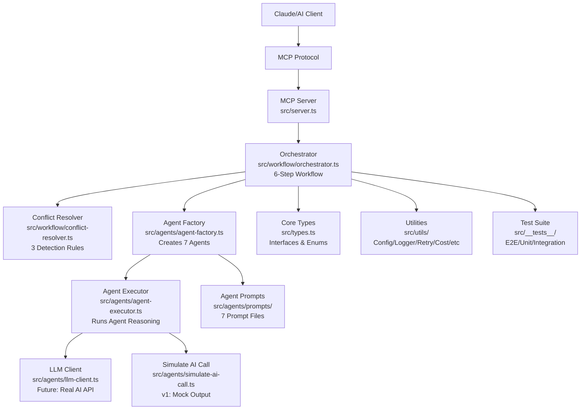

# PROJECT KNOWLEDGE BASE

**Generated:** 2026-02-05T15:52:55Z
**Commit:** (unknown)
**Branch:** (unknown)

## BUN RUNTIME CONVENTIONS

- `bun install` not npm/yarn/pnpm
- `bun test` not jest/vitest
- `bun test src/__tests__/` runs specific test files
- `bun run src/server.ts` not node
- `bun:sqlite` not better-sqlite3
- `Bun.serve()` not express

---

## PROJECT STATUS

**分析日期**: 2026-02-05
**总体评分**: **3.25/5** 🟡 可接受但未准备好生产
**生产就绪度**: **2.0/5** 🔴 高风险

### 各维度评分

| 维度 | 评分 | 状态 |
|-------|--------|------|
| 架构设计 | 3.5/5 | 🟡 可接受 |
| Agent实现 | 3.675/5 | 🟡 可接受 |
| 工作流效率 | 2.5/5 | 🔴 差 |
| 测试覆盖 | 2.5/5 | 🔴 差 |
| MCP集成 | 3.5/5 | 🟡 可接受 |
| 可维护性 | 3.5/5 | 🟡 可接受 |
| 愿景对齐 | 3.4/5 | 🟡 可接受 |

### 当前状态

**优势**:
- ✅ 清晰的4层架构设计(Server → Workflow → Agents → Prompts)
- ✅ 一致的Agent实现模式
- ✅ 良好的类型定义和接口设计
- ✅ 完整的文档系统(5个模块CLAUDE.md)

**关键问题**:
- 🔴 **P0 Bug: 冲突检测失效** - `conflict-resolver.ts:29` 正则表达式构造错误
- 🔴 **P0 Bug: 无收敛检测** - 浪费33-66%计算资源
- 🔴 **P0 Bug: E2E测试全失败** - 无法验证MCP集成
- 🔴 **类型安全被破坏** - 多处`as any`绕过TypeScript检查
- 🔴 **测试覆盖率过低** - 仅20%, 所有E2E测试超时

**技术债务**:
- agent-executor.ts过大(354行), 违反单一职责原则
- 15+个魔法数字分散在8个文件中
- 存在重复代码(cost-alert.ts预算检查重复2次)
- retry.ts复杂度过高(106行)

---

## KNOWN ISSUES

### P0 - 阻塞性问题(立即修复)

| 优先级 | 问题 | 文件 | 影响 | 修复时间 |
|--------|------|------|--------|----------|
| P0 | 冲突检测正则表达式bug | conflict-resolver.ts:29 | 功能失效 | 2h |
| P0 | 无工作流收敛检测 | orchestrator.ts:140 | 浪费33-66%资源 | 3h |
| P0 | E2E测试全部超时 | e2e.test.ts | 无法验证MCP | 4h |
| P0 | 不安全的类型转换 | 多个文件 | 运行时错误风险 | 4h |

**P0修复总时间**: 13小时(1.5天)

### P1 - 重要问题(本周修复)

| 优先级 | 问题 | 文件 | 影响 | 修复时间 |
|--------|------|------|--------|----------|
| P1 | Agent执行器职责过重 | agent-executor.ts | 难以测试 | 16h |
| P1 | 无Agent结果缓存 | orchestrator.ts | 80%计算浪费 | 8h |
| P1 | 重复的预算检查代码 | cost-alert.ts:28-29,90-91 | 维护负担 | 1h |
| P1 | 魔法数字分散 | 8个文件 | 难以理解 | 2h |

---

## OVERVIEW

**项目名称**: SocialGuessSkills - 社会体系建模多Agent系统

**核心功能**:
- 7个专业Agent协作分析社会体系假设
- 6步推演流程管理(验证→执行→冲突对齐→合成→验证→迭代)
- 生成9层结构化社会体系模型
- 3种冲突检测规则(逻辑/优先级/风险叠加)
- MCP Protocol集成(3个工具: reasoning/query_agent/validate_model)

**技术栈**:
- TypeScript (严格模式,类型安全)
- Bun Runtime (快速执行,内置测试)
- MCP SDK (Model Context Protocol)
- Anthropic SDK (未来真实AI集成)
- Pino (结构化日志记录)

**设计理念**:
- Prompt-based Agent架构(非训练独立模型) - 灵活性、可解释性
- 明确的6步流程(非自治Agent协商) - 可预测性、可控性
- 结构化9层模型(全面性和可扩展性) - 易于理解和扩展

---

## ARCHITECTURE VISUALIZATION



**说明**:
- 4层架构: Server → Workflow → Agents → Prompts
- 核心文件: orchestrator.ts (6步流程), agent-factory.ts (Agent创建)
- 关键组件: 冲突解析器(3种规则), LLM客户端(真实AI集成)
- 支持层: 类型定义, 工具函数, 测试套件

---

## MODULE INDEX

| 模块 | 路径 | 职责 | 文档 |
|------|------|------|------|
| Agents | `src/agents/` | Agent工厂、执行器、LLM客户端、Prompt模板 | [src/agents/CLAUDE.md](src/agents/CLAUDE.md) |
| Workflow | `src/workflow/` | 编排器、冲突解析器、6步流程 | [src/workflow/CLAUDE.md](src/workflow/CLAUDE.md) |
| Utils | `src/utils/` | 配置、日志、重试、成本控制、熔断器 | [src/utils/CLAUDE.md](src/utils/CLAUDE.md) |
| Tests | `src/__tests__/` | 端到端测试、单元测试、集成测试 | [src/__tests__/CLAUDE.md](src/__tests__/CLAUDE.md) |

**快速导航**: 使用链接快速跳转到模块详细文档

---

## GLOBAL CONVENTIONS

### TypeScript规范
- 严格模式启用 (tsconfig.json: strict: true)
- 使用接口定义契约 (src/types.ts)
- 类型注释用于文档 (JSDoc注释导出类型)

### Bun运行时规范
- 包管理: `bun install` (非 npm/yarn/pnpm)
- 测试运行: `bun test src/__tests__/` (非 jest/vitest)
- 服务器启动: `bun run src/server.ts`
- SQLite: `bun:sqlite` (非 better-sqlite3)
- HTTP服务: `Bun.serve()` (非 express)

### MCP集成规范
- 工具注册: 使用 `(mcpServer as any).registerTool()` (SDK quirks)
- 工具命名: reasoning, query_agent, validate_model
- 请求/响应: 标准MCP Protocol格式

### Agent输出规范
所有Agent必须返回统一格式:
```typescript
{
  conclusion: string,      // 核心结论
  evidence: string[],      // 支持结论的证据
  risks: string[],        // 识别的风险
  suggestions: string[],  // 改进建议
  falsifiable: string    // 可证伪假设点
}
```

### 工作流约定
- 6步流程: 假设验证 → Agent执行 → 冲突对齐 → 模型合成 → 模型验证 → 迭代收敛
- 最大迭代: 默认3次迭代,防止无限循环
- Agent优先级矩阵: Risk(5) > Governance(4) > Systems(3) > Econ/Socio/Culture(2) > Validation(1)
- 冲突检测: 逻辑矛盾 + 优先级冲突 + 风险叠加

---

## KEY ENTRY POINTS

| 入口点 | 文件 | 说明 |
|--------|------|------|
| MCP服务器入口 | `src/server.ts` | MCP Protocol实现,工具注册(3个工具) |
| 工作流编排入口 | `src/workflow/orchestrator.ts` | `runWorkflow()` - 6步流程主入口 |
| Agent创建入口 | `src/agents/agent-factory.ts` | `createAllAgents()` - 批量Agent创建入口 |
| 核心类型定义 | `src/types.ts` | 所有接口和枚举定义(136行) |

---

## WHERE TO LOOK

| Symbol | Type | Location | Refs | Role |
|--------|------|----------|------|------|
| AgentType | enum | src/types.ts:1 | 10+ | 7 agent types (systems/econ/socio/governance/culture/risk/validation) |
| Hypothesis | interface | src/types.ts:3 | 5+ | Input assumptions/constraints/goals |
| SocialSystemModel | interface | src/types.ts:26 | 3+ | Final output structure |
| SystemStructure | interface | src/types.ts:38 | 2+ | 9-layer model architecture |
| runWorkflow | function | src/workflow/orchestrator.ts:14 | 2+ | Main entry point |
| executeAgent | function | src/agents/agent-executor.ts:3 | 2+ | AI simulation (no real LLM calls) |
| detectConflicts | function | src/workflow/conflict-resolver.ts:3 | 2+ | 3 conflict detection rules |
